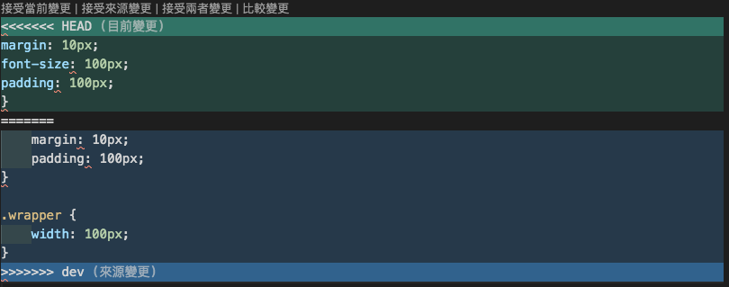

## 題目
### JavaScript程式基礎訓練
#### 1. JavaScript 程式開發
- 環境設定
  - 如何在本地安裝 `Node.js` 與 `npm`
    * Node.js 是一個可以在伺服器上執行 JavaScript 的平台，npm 是 node.js 的套件管理工具，在安裝 node 的時候會一起安裝
    * Node 官網下載安裝，安裝完畢後 CMD 或 終端機 輸入 node -v，有出現版本號代表下載成功
    * node.js 提供執行 js 的環境，npm 可更方便管理開發過程中需要的函式庫和工具
  - 使用 `npm` 初始化專案 (package.json)
    * package.json 是 npm 用來描述專案的設定檔，紀錄專案名稱、版本等資訊
    * 在專案資料夾，開啟終端機後輸入 npm init，或快速建立預設 npm init -y
  - 如何確認當前所在的專案環境 (使用 node -v 和 npm -v 確認版本)
    * node -v 和 npm -v 用來檢查目前系統安裝的 node.js 與 npm 的版本
    * 使用方式：終端機輸入 node -v 和 npm -v
    * 確認版本可以知道目前使用的工具是否符合專案需求，可能某些專案需要在特定版本的 node.js 上才能正常運作
  - 全域安裝與專案安裝套件
    * 全域安裝：套件會安裝在整個系統，可以在任何地方使用，適合用在安裝 CLI 工具，使用時在終端機輸入 npm install -g <套件名>
    * 專案安裝：套件只會安裝在當前專案的 node_modules 中，適合用在需要不同版本的工具，使用時在專案資料夾的終端機輸入 npm install <套件名>
  - 如何設定與使用 `.env` 環境變數
    * .env 用來設定專案中的環境變數，例如：API金鑰
    * 使用時在專案跟目錄建立 .env 檔案，下載並用 dotenv 套件來讀取環境變數，在程式碼中載入`require('dotenv').config()`，用意是將敏感設定放到 .env 中，不僅提供安全性，也能讓同一份程式碼在不同環境中使用不同設定
- 開發工具
  - 常見的 JavaScript 開發工具與 IDE (WebStorm)
    * IDE 工具是協助開發者撰寫、除錯、管理與部屬 js 程式碼的軟體環境，常見的 IDE 工具有：VS Code、WebStorm
#### 2. JavaScript 基本練習
- 資料結構
  - Array (陣列)
    - 說明什麼是Array (定義、特性、用途等)，如何建立一個Array
     => 存儲數據的一種資料結構，可以存儲任何型別的資料(數字、字串、物件、陣列)，有索引的概念(第一位從0開始)，方便使用迴圈操作資料，建立方式例如：
    ```js
    const arr = [1, 2, 3]
    ```
    - 常見的陣列方法：`push()`, `pop()`, `shift()`, `unshift()`, `concat()`, `join()`, `slice()`, `splice()`, `map()`, `filter()`, `sort()`等
      * 以下以`const arr = [1, 2, 3]`為例依序說明：
        * 陣列的最後加入，會改變原始陣列：
        ```js
        arr.push(4) //[1, 2, 3, 4]
        ```
        * 陣列的最後減去一個，會改變原始陣列：
        ```js
        arr.pop() //[1, 2]
        ```
        * 陣列的最前減去一個，會改變原始陣列：
        ```js
        arr.shift() //[2, 3]
        ```
        * 陣列的最前加入，會改變原始陣列：
        ```js
        arr.unshift(0) //[0, 1, 2, 3]
        ```
        * 合併陣列，不會改變原始陣列：
        ```js
        const arr2 = [4, 5]; let res = arr.concat(arr2); //res 是 [1, 2, 3, 4, 5]
        ```
        * 將陣列內的元素以""的內容串起，返回字串，不會改變原始陣列：
        ```js
        res = arr.join("") //res 是 "123"
        ```
        * 複製陣列內的元素，slice(從索引幾開始複製, 到索引幾結束[不包含])，不會改變原始陣列：
        ```js
        res = arr.slice(0, 2) //res 是 [1, 2]
        ```
        * 插入/刪除/取代陣列內的元素，splice(從索引幾開始, 到索引幾結束[不包含], 插入內容)，會改變原始陣列：
        ```js
        arr.splice(0, 2, '取代') //arr 變成['取代', 3]
        ```
        * 對陣列中的值進行加工之後回傳新陣列，不會改變原始陣列：
        ```js
        res = arr.map((item, index) => {return item*2}) //res 是 [2, 4, 6]
        ```
        * 對陣列中的值進行篩選之後回傳新陣列，不會改變原始陣列：
        ```js
        res = arr.filter(item => item %2 === 0) // res 是 [2]
        ```
        * 對陣列中的數值進行由小到大的排序，不會完整判斷整個數字的大小，而是從左邊的數值開始判斷大小，會改變原陣列：
        ```js
        const arr3 = [19, 68, 35, 7]; arr3.sort() //[19, 35, 68, 7]
        ```
    - Array Destructuring
      => 陣列的解構賦值，把陣列中的數據快速賦值給變數，可提升可讀性，快入提取特定資料，例如：
      ```js
      let [a, b, c] = [10, 20, 30]; console.log(a) //10
      ```
  - Object (物件)
    - 說明什麼是Object (定義、特性、用途等)，如何建立一個Object
      * 存儲鍵值對的一種資料結構，沒有辦法透過索引獲取，只能透過指定屬性名的方式獲取或改變值，每一個屬性名在該物件中都只會有一個，屬性名型別是字串，值可以是任意型別，如果改變的屬性名已經有值了，就只會變成修改該屬性名的值，而非再新增，可以用來描述一個「具有多種特性或屬性」的資料時使用，建立方式例如：
      ```js
      const obj = {name:"Jack", age:18}
      ```
    - 常見的物件方法：`Object.keys()`, `Object.values()`, `Object.entries()`, `Object.assign()`, `Object.create()` 等
     * 以下以`const obj = {name:"Jack", age:18}`為例依序說明：
        * 取出屬性名返回新陣列：
        ```js
         console.log(Object.keys(obj)) //['name', 'age']
        ```
        * 取出屬性值返回新陣列：
        ```js
         console.log(Object.values(obj)) //['Jack', 18]
        ```
        * 把物件的屬性內容轉成陣列，一個鍵值對轉一個陣列：
        ```js
         console.log(Object.entries(obj)) //[['name', 'Jack'], ['age', 18]]
        ```
        * 合併物件：
        ```js
        const obj2 = {fav: "music"}; console.log(Object.assign(obj, obj2)) //{name: 'Jack', age: 18, fav: 'music'}
        ```
        * 建立以某個物件為原型的新物件：
        ```js
        const obj3 = {fine(){console.log("good")}}; const saygood = Object.create(obj3); saygood.fine() //good
        ```
    - Object Destructuring
        * 物件的解構賦值，把物件中的屬性值快速賦值給相對應的屬性名，可提升可讀性，快入提取特定資料，例如：
        ```js
        const {name, age} = obj; console.log(age); // 18
        ```
  - Set (集合)
    - 什麼是Set (定義、特性、用途等)，如何建立一個Set
      * 存儲唯一值的集合，不能有重複元素，當需要保證資料不重複時可以使用，例如：存儲使用者 ID、過濾重複項目，建立方式例如：
      ```js
      const mySet = new Set()
      ```
    - 常見的Set方法：`add()`, `delete()`, `has()`, `clear()` 等
      * 以下以 `const mySet = new Set()` 為例依序說明：
        * 加入新值：
         ```js
          mySet.add(1); console.log(mySet) //Set(1){1}
         ```
        * 刪除指定值：
         ```js
          mySet.delete(1); console.log(mySet) //Set(0) {size: 0}
         ```
        * 檢查該元素是否存在：
         ```js
         console.log(mySet.has(2)) //false
         ```
        * 清空所有元素：
        ```js
        mySet.clear(); console.log(mySet) //Set(0) {size: 0}
        ```
  - Map 
    - 說明什麼是Map (定義、特性、用途等)，如何建立一個Map
      * 存儲鍵值對的一種資料結構，相對於 Object，他可以存儲任何型別的屬性名，對於頻繁的新增/刪除操作效能更好，使用彈性較高，建立方式例如：
      ```js
      const myMap = new Map()
      ```
    - 常見的Map方法：`set()`, `get()`, `delete()`, `has()`, `clear()`, `keys()`, `values()`, `entries()` 等
      * 以下以 `const myMap = new Map()` 為例依序說明：
        * 設定新鍵值：
          ```js
          myMap.set('name', 'Jack'); console.log(myMap)//Map(1){'name' => 'Jack'}
          ```
        * 取得指定 key 的值：
          ```js
           console.log(myMap.get('name')) //Jack
          ```
        * 刪除某個 key：
          ```js
           myMap.delete('name'); console.log(myMap)//Map(0) {size: 0}
          ```
        * 檢查 key 是否存在：
          ```js
           console.log(myMap.has('name')) //true
          ```
        * 清除所有資料：
          ```js
           myMap.clear(); console.log(myMap) //Map(0){size: 0}
          ```
        * 回傳所有 key：
          ```js
           console.log(myMap.keys()) //MapIterator{'name'}
           ```
        * 回傳所有 value：
          ```js
          console.log(myMap.values()) //MapIterator {'Jack'}
          ```
        * 回傳所有鍵值對的迭代器對象：
          ```js
          console.log(myMap.entries()) //MapIterator{'name' => 'Jack'}
          ``` 
- Function (函式 or 函數 or 方法)
  - 普通函數與箭頭函數
    - `函數宣告(Function Declaration)` 與 `表達式 (Function Expression)`
      * 函數宣告式：使用 function 關鍵字聲明函數，會被預解析，可以在函數被宣告之前就調用，例如：
        ```js
        function app(){console.log("app")}
        ```
      * 函數表達式：將函數賦值給一個變量，或作為另一個函數的參數，不會被預解析，無法在函數被宣告前就調用，適合用在動態建立函數使用，例如：
        ```js
        let app = function(){console.log("app")}
        ```
    - 箭頭函數(Arrow Function)：箭頭函數與 `this` 的關係
       * 箭頭函數不會綁定自己的 this，而是繼承外層的 this，若它的外層函數也是箭頭函數，則會繼續往上尋找，直到找到全域環境的預設 this，例如：
      ```js
       const obj = {
           name: 'Anna',
           sayHi: function () {
               setTimeout(() => {
                   console.log(`Hi, ${this.name}`); 
               }, 1000);
           }
       };
       obj.sayHi() //箭頭函數在 sayHi 方法中定義，外層的 this 指向 sayHi 的物件 obj，所以得出結果 Hi, Anna
      ```
       * 不適合使用 call、apply、bind 來綁定 this 值，綁定值會無效，在一般函數的 this，取決於函數如何被調用來決定，一般函數的 this 可以被綁定，如下範例1，但箭頭函數的 this 綁定會無效，如下範例2：
      ```js
      const obj = {
        num:100
      }
      window.num = 200
      
      const add = function (a, b, c){
        return this.num + a + b + c
      }
      const res = add.call(obj, 1, 2, 3)
      console.log(res) //由於綁定的 this 是obj，所以 res 是 106
      ```
      ```js
      const obj = {
        num:100
      }
      window.num = 200
      
      const add = (a, b, c) => {
        return this.num + a + b + c
      }
      const res = add.call(obj, 1, 2, 3)
      console.log(res) //由於綁定的 this 無效，add 函數的 this 指向 window，所以 res 是 206
      ```
       * 箭頭函數沒有自己的 this 這個特性，適合用在 setTimeout() 和 addEventListener() 中，因為它可以自動綁定在適合的範圍中，以下以 setTimeout() 為例說明一般函數與箭頭函數的 this 區別：
      ```js
      const obj = {
          num:100,
          doSomethingLater(){
              setTimeout(function (){  //這裡使用的是普通函數，this 會根據誰調用它來決定，因為 setTimeout 是由瀏覽器在調用此回調函數，因此 this 不會指向 obj
                  this.num++
                  console.log(this.num) //NaN，因為在 window 中沒有 count，所以運算實際上是 window.num++
              },1000)
          }
      }
      obj.doSomethingLater()
      ```
      ```js
      const obj = {
        num:100,
        doSomethingLater(){
            setTimeout(() => {  //箭頭函數，this 指向 最接近的父層所指的 this 值，這裡是 obj
            this.num++
            console.log(this.num) //101  
          },1000)
        }
      }
      obj.doSomethingLater()
      ```
       * 補充說明 call、apply、bind 用法
         * call：以在()內傳入的第一個參數來綁定 this 的指向，以下範例說明：
         ```js
          const human = {
              name: 'Jack',
              age: 18,
              heal() {
                console.log(`${this.name} is ${this.age} years old.`)
              }
          }
          const power = {
              name: 'Rose',
              age: 20
          }
          human.heal() //Jack is 18 years old.
          human.heal.call(power) //Rose is 20 years old.
         ```
         * apply：以在()內傳入的第一個參數來綁定 this 的指向，與 call 不同的是，可以傳入陣列作為第二個參數，以下範例說明：
         ```js
          const human = {
              name: 'Jack',
              age: 18,
              heal(fav, what) {
                  console.log(`${this.name} is ${this.age} years old. ${fav} is ${what}.`)
              }
          }
          const power = {
              name: 'Rose',
              age: 20
          }
          human.heal.apply(power, ['Hobby', 'singing']) //Rose is 20 years old. Hobby is singing.
         ```
          * bind：使用時不會被立即調用，但會返回一個新函數，以在()內傳入的第一個參數來綁定 this 的指向，等待後續的調用，以下範例說明：
         ```js
          const human = {
              name: 'Jack',
              age: 18,
              heal(fav, what) {
                  console.log(`${this.name} is ${this.age} years old. ${fav} is ${what}.`)
              }
          }
          const power = {
              name: 'Rose',
              age: 20
          }
          const greatHuman = human.heal.bind(power)
          greatHuman('Hobby', 'singing') //Rose is 20 years old. Hobby is singing.
         ```
- 函數參數與回傳值
  - 預設參數、剩餘參數 (Rest parameters)、解構參數
    * 預設參數：給函數的參數設定預設值，如果調用函數時沒有給值，就使用預設值，使用方式例如：
  ```js
    function greet(name = 'Guest') {
      console.log(`Hello, ${name}`);
  }
  ```
    * 剩餘參數：用 ... 把不定數量的參數收集為一個陣列，使用方式例如：
  ```js
    function sum(...numbers) {
      return numbers.reduce((acc, cur) => acc + cur, 0);
  }
  ```
    * 解構參數：直接在函式參數中對物件或陣列解構取值，使用方式例如：
  ```js
    function showUser({ name, age }) {
      console.log(`${name} is ${age} years old.`);
    }
  ``` 
- return 與 yield
      * return：一般函式都會用此方式結束函式執行並回傳值，使用方式例如：`function square(num) {return num * num}`
      * yield：在 generator 函式中，用來暫停函式執行、保留狀態，並回傳中間結果，可以讓函式分段執行，適用於建立可迭代對象等進階需求，使用方式例如：`function generator() {yield 1;yield 2;yield 3;}`
- Scope 與 Closure
  * Scope(作用域)：指變數或函式在哪裡可以被存取，主要分為 全局作用域/區塊作用域(由{}內界定的特定程式碼區塊)，當決定了變數的存取範圍也能避免命名衝突和記憶體浪費，舉例說明：
  ```js
  let a = 10;
   function test() {
      let b = 5;
      console.log(a);
   }
   test() // a 變數在全局作用域範圍宣告，因此在函式內部可以獲取值
   console.log(b) // 報錯：b is not defined，b 變數在函式的區塊作用域宣告，因此在全局範圍無法獲取值
  ```
  * Closure(閉包)：當函式「記住並使用了它外部函式的變數」，即使外部函式已經執行完畢，也能存取，使用方式例如：
  ```js
    function createCounter() {  
      let count = 0;
      return function() {
      count++;  
      return count;  
    };  
  }
  const counter = createCounter();  
  console.log(counter()); // 1  
  console.log(counter()); // 2  
  console.log(counter()); // 3
  ```
- 常見工具與方法
  - typeof 和 instanceof 運算符
    * typeof：檢測數據的類別，例如：`console.log(typeof true) //boolean`
    * instanceof：某物件是否由某個構造函式建立的，例如：`console.log(new Date() instanceof Date) //true`
#### 3. JavaScript 進階練習
- Package 與 Module
  - 什麼是 Package 與 Module
    * Package：套件，包含一個或多個模組(Module)的集合，通常會有一個資料夾包含其內容，需要透過 package.json 管理
    * Module：模組，定義一些可重複使用的程式碼，可以透過 import/export 來使用，通常會是 .js 檔
  - 如何使用 `import` 與 `export` 來引入與匯出模組
    * 檔案 app.js 內假設只有一個預設匯出，例如 `export default function app(){}`，引入的時候只需要寫 `import app form 'app.js'；`，
      如果有多個命名匯出，例如 `export function app1(){}; export function app2(){}`，引入的時候則需要寫 `import {app1, app2} form 'app.js'`
- Promise 與 Async/Await
  - 說明什麼是Promise，以及如何使用它
    * 處理非同步操作的物件，有三種狀態-pending(進行中)、fulfilled(成功完成)、rejected(失敗)，可以搭配 .then()/.catch() 鍊式操作，主要用來解決回調地域(callback hell)問題，讓程式碼更易閱讀
  - 說明如何使用 `async` 與 `await` 進行非同步操作的處理
    * async/await 是 Promise 的語法糖，用同步風格寫非同步邏輯，更易讀易懂，使用方式例如：
  ```js
  async function getData() {
      try {
          const result = await fetchData();
          console.log(result);
      } catch (err) {
          console.error(err);
      }
  }
  ```
- 異常處理 (try...catch)與實踐原則
   * 是一種讓 js 程式碼即使出錯也能持續運行的機制，可以避免錯誤中斷程式碼，也能夠提供清楚的錯誤提示，使用方式例如(上述)
- 非同步操作與事件循環
  - 事件循環 (Event Loop) 的概念
   * 由於 js 是單執行緒的語言，透過 event loop 管理同步與非同步的任務的執行順序，確保程式能流暢處理大量操作而不阻塞主執行緒，例如：
  ```js
   console.log('A');
   setTimeout(() => console.log('B'), 0);
   console.log('C'); // 輸出順序為 A → C → B
  ```
  - 說明 `setTimeout` 與 `setInterval` 的概念與使用
   * setTimeout：延遲執行一次程式碼，例如：`setTimeout(() => console.log('一秒後執行'), 1000); //一秒後會執行，但只執行一次`
   * setInterval：每隔固定時間重複執行程式碼，例如：`setInterval(() => console.log('一秒後執行'), 1000); //一秒後會執行，接下來每格一秒執行一次`
  - 如何理解 `callback` 和 `Promise` 的區別與優勢
   * callback：結構較混亂，容易造成 callback hell，且每層都要加錯誤處理，維護起來較為困難
   * Promise：結構較清晰，使用 catch() 統一處理錯誤，較易維護
- 提升 (Hoisting)
  - JavaScript 的提升是什麼意思
   * Hoisting(提升/預解析)，指的是變數與函式在執行前會被瀏覽器掃描，並將它們放在作用域的頂部
  - `var`, `let` 與 `const` 的提升
   * 由 var 宣告的變數在進行預解析後，即使在宣告前進行使用，也只會得到 undefined 的結果，可以重複做宣告
   * let 在宣告前使用會報錯，不能重複宣告
   * const 在宣告前使用會報錯，不能重複宣告或改值
  - `function` 的提升
   * function 使用函數宣告式在進行預解析後，可以在宣告前使用也不會報錯;但使用 函數表達式則無法在宣告前使用
  ```js
  app() //app
  function app(){console.log("app")}
  app2() //app2 is not a function
  const app2 = function(){console.log("app2")}
  ```
#### 4. JavaScript 延伸練習
- 日誌與異常處理
  - log 類型的介紹 (console.log, console.error, console.warn, console.info)
   * console.log：可以透過開發者工具查看輸出變數或狀態
   * console.error：可在開發者工具看到紅色的警告提示
   * console.warn：可在開發者工具看到黃色的警告提示
   * console.info：可在開發者工具看到額外補充說明
  - 使用套件 `winston` 進行日誌記錄
   * 是一個 node.js 的日誌紀錄套件，可以記錄不同層級的訊息，並支援存儲到檔案、終端或外部服務
   * 在終端機輸入 npm install winston 安裝
   * 使用範例：
```js
    import winston from 'winston';
    const logger = winston.createLogger({
        level: 'info',
        transports: [
    new winston.transports.Console(),  // 輸出到終端
    new winston.transports.File({ filename: 'error.log', level: 'error' }), // 錯誤寫入檔案
    ],
    });
    logger.info('這是 info');
    logger.error('這是 error');
```
- 命名慣例
  - Package
    * 小寫 + dash 分隔，例如：my-user-app
  - Module
    * 開頭小寫 + 駝峰/dash，例如：myApp.js
  - Variable
    * 開頭小寫 + 駝峰，例如：myApp
  - Constant
    * 全大寫 + 底線分隔，例如：MY_APP
  - Function
    * 駝峰 + 動詞開頭，例如：getMyApp()
  - Class
    * 每字首大寫，例如：UserApp
  - Event Handler
    * 開頭常用 on 或 handle，例如：handleClick, onSubmit
### git
- 什麼是git
  * 版控系統，可記錄程式碼歷程，管理多人開發流程，避免資料覆蓋，也能記錄每次修改，便於還原或追蹤問題
  * 使用時透過 git 指令操作，可以結合 github 等平台遠端同步程式碼
- 如何建立git repository
  - 全新的專案
    * 進入專案資料夾，cd 資料夾名稱
    * git init 初始化(產生 .git資料夾，通常會是隱藏檔案) 
    * git add . (.是全部的意思) 
    * git commit -m "Initial commit" 
    * 在github 建立新的 repository 
    * git remote add origin 遠端url
    * git push -u origin main
  - 已經有使用git版控的專案
    * 查看目前遠端設定 git remote -v 
    * 新增遠端倉庫 git remote add origin 遠端url / 更換 git remote set-url origin 新遠端url
    * 推送 git push -u origin main
- .gitignore的意義
  * 不想要上傳到 github 上的檔案可以寫入，通常會是套件(node_modules)或環境設置(.env)，可減少專案體積、提升效能
- 如何進行提交(commit)
  * 確認目錄有哪些檔案還沒加入暫存區 git status 
  * git add . 
  * git commit -m "第1次修改"
- 檔案還原
  * git restore --staged 檔案名稱
- 如何切換branch
  * git branch 分支名稱 (建立分支)
  * git checkout 分支名稱(切換分支)
- 何為衝突(conflict)

  * 兩個分支修改了同一個檔案或同一行程式碼，導致 git 無法判定，需要手動修改解除衝突，修改完之後要再提交一次
 