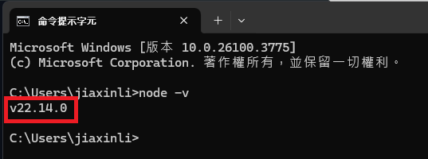

## 題目

### JavaScript程式基礎訓練

#### 1. JavaScript 程式開發

- 環境設定
    - 如何在本地安裝 `Node.js` 與 `npm`
        * 到 Node 官網下載安裝 (https://nodejs.org/zh-tw/download)；npm 在安裝 node 的時候也會一起安裝
          
        * 安裝完畢後 CMD 或 終端機 輸入 node -v，有出現版本號代表下載成功，如下圖
          
        * Node.js 是能夠讓 JavaScript 在電腦上運行的工具，基於 Chrome 的 V8 JavaScript 引擎建立，原本 JavaScript
          檔案只能在瀏覽器上被執行，但是在電腦上安裝了
          Node.js 之後，就可以執行副檔名為 .js 的 JavaScript 的檔案，而不只受限於瀏覽器環境，以下範例：
            * 新增一個 .js 檔，編寫 js 程式碼之後打開命令行介面(terminal)輸入：node <檔案名稱>，可以看到程式碼的結果，如下圖：
              
        * 推薦下載並使用 node 的原因：
            1. 可用來開發後端應用(例如 express)、處理資料庫請求（例如 MongoDB、MySQL）
            2. 可使用 npm 安裝工具或函式庫
            3. 執行開發工具或指令，例如打包指令(npm run build)
        * 補充 Chrome 的 V8 JavaScript 引擎：一個由 Google 開發的 高效能 JavaScript 執行引擎，它最初是為了 Google Chrome
          瀏覽的器而開發的，但現在也被用在很多其他地方，比如 Node.js，主要作用是把 JavaScript 轉成電腦可以直接理解和執行的語言，
          並且提升速度與效能，特別是執行大量 JavaScript 程式時
    - 使用 `npm` 初始化專案 (package.json)
        * 在專案資料夾，開啟終端機後輸入 npm init，或快速建立預設 npm init -y
        * 使用 npm 初始化專案，npm init 會逐步詢問設定問題，通常包括：專案名稱、版本號、描述、作者、授權...等，根據回答，npm
          會在根目錄生成一個 package.json 檔案
        * package.json 會被用來描述專案的設定檔，紀錄專案名稱、版本、依賴的套件等資訊
        * 團隊中的其他開發者只需要下載該專案的 package.json，就能使用 npm install 指令一鍵安裝所有需要的套件
    - 如何確認當前所在的專案環境 (使用 node -v 和 npm -v 確認版本)
        * node -v 和 npm -v 用來檢查目前系統安裝的 node.js 與 npm 的版本
        * 使用方式：終端機輸入 node -v 和 npm -v，會看到以下版本號
          
        * 確認版本可以知道目前使用的工具是否符合專案需求，可能某些專案需要在特定版本的 node.js 上才能正常運作
    - 全域安裝與專案安裝套件
        * 全域安裝：套件會安裝在整個系統，可以在任何地方使用，適合用在 安裝 CLI 工具，使用時在終端機輸入 npm install -g <
          套件名>
            * 補充 CLI 工具介紹：是一種通過命令行界面與電腦或操作系統進行互動的應用程式，常見開發工具例如：Create React
              App(
              用於創建 React 應用的命令行工具)、構建打包工具：Gulp(用於自動化開發流程的任務執行器)
        * 專案安裝：套件只會安裝在當前專案的 node_modules 中，適合用在需要不同版本的工具，使用時在專案資料夾的終端機輸入
          npm install <套件名>
    - 如何設定與使用 `.env` 環境變數
        * .env 主要用來設定專案中的環境變數，用意是將敏感設定放到 .env 中，不僅提供安全性，也能讓同一份程式碼在不同環境中使用不同設定，例如：測試環境使用
          .env.test；本機使用 .env.local
        * 使用時在專案根目錄建立 .env 檔案
        * 終端機輸入指令安裝 dotenv 套件：npm install dotenv (不建議全域安裝，因為每個專案可能使用不同套件，且記錄到
          package.json 後，其他人下載專案時就能自動拉到正確版本)
        * 在主程式檔案中（例如 main.js 或 index.js）的最上方載入`require('dotenv').config()`；如果想使用不同的 env 檔案，可以在呼叫
          config() 方法時傳入一個參數，例如`require('dotenv').config({path: '.env.development'})`
        * 示意圖
          
        * 當載入 dotenv 套件並使用它的 config() 方法後，就能使用 process.env 來取得 env 內對應變數的內容，因為在 env
          設定的每一組變數(例如：API_KEY=abc123)，都會加入到 node.js 的 process.env 物件中，如下範例：
            * 設置 env 變數
              
            * 獲取 env 變數
              
        * 使用時的注意事項：
            1. 記得要把 .env 檔案加到 .gitignore 中
            2. env 的變數習慣以大寫命名，撰寫格式會是 KEY=VALUE，如下範例：
          ```text
            API_KEY=abc123
          ```
            3. 通常會放到 env 的內容有：金鑰、密碼，或根據需求放入網站名稱、網站網址等等
            4. 前端的 env 不適合放敏感資訊，因為前端的程式碼是會被打包後直接在瀏覽器上執行的；後端的 env
               相對安全，因為後端的程式碼是運行在伺服器上
               
               
- 開發工具
    - 常見的 JavaScript 開發工具與 IDE (WebStorm)
        * IDE 工具是協助開發者撰寫、除錯、管理與部屬 js 程式碼的軟體環境，常見的 IDE 工具有：VS Code、WebStorm
    - webstorm 使用補充：
        * 快速尋找方法或參數的「源頭」或是「有哪些方法在使用」：快捷鍵 Ctrl / Cmd + 點選
        * 格式化程式碼：快捷鍵 Ctrl+Alt+L (Windows) / Cmd+Option+L (macOS)

#### 2. JavaScript 基本練習

- 資料結構
    - Array (陣列)
        - 說明什麼是Array (定義、特性、用途等)，如何建立一個Array
          => 存儲數據的一種資料結構，可以存儲任何型別的資料(數字、字串、物件、陣列)，有索引的概念(第一位從0開始)
          ，方便使用迴圈操作資料，建立方式例如：
      ```js
      const arr = [1, 2, 3]
      ```
        - 常見的陣列方法：`push()`, `pop()`, `shift()`, `unshift()`, `concat()`, `join()`, `slice()`, `splice()`,
          `map()`, `filter()`, `sort()`等
            * 以下以`const arr = [1, 2, 3]`為例依序說明：
                * 陣列的最後加入，會改變原始陣列：
              ```js
              arr.push(4) //[1, 2, 3, 4]
              ```
                * 陣列的最後減去一個，會改變原始陣列：
              ```js
              arr.pop() //[1, 2]
              ```
                * 陣列的最前減去一個，會改變原始陣列：
              ```js
              arr.shift() //[2, 3]
              ```
                * 陣列的最前加入，會改變原始陣列：
              ```js
              arr.unshift(0) //[0, 1, 2, 3]
              ```
                * 合併陣列，不會改變原始陣列：
              ```js
              const arr2 = [4, 5]; 
              let res = arr.concat(arr2); //res 是 [1, 2, 3, 4, 5]
              ```
                * 將陣列內的元素以""的內容串起，返回字串，不會改變原始陣列：
              ```js
              let res = arr.join("") //res 是 "123"
              ```
                * 複製陣列內的元素，slice(從索引幾開始複製, 到索引幾結束[不包含])，不會改變原始陣列：
              ```js
              let res = arr.slice(0, 2) //res 是 [1, 2]
              ```
                * 插入/刪除/取代陣列內的元素，splice(從索引幾開始, 到索引幾結束[不包含], 插入內容)，會改變原始陣列：
              ```js
              arr.splice(0, 2, '取代') //arr 變成['取代', 3]
              ```
                * 對陣列中的值進行加工之後回傳新陣列，不會改變原始陣列：
              ```js
              let res = arr.map((item, index) => item*2 ) //res 是 [2, 4, 6]
              ```
                * 對陣列中的值進行篩選之後回傳新陣列，不會改變原始陣列：
              ```js
              let res = arr.filter(item => item %2 === 0) // res 是 [2]
              ```
                * 對陣列中的數值進行由小到大的排序，不會完整判斷整個數字的大小，而是從左邊的數值開始判斷大小，會改變原陣列：
              ```js
              const arr3 = [19, 7, 68, 35]; 
              arr3.sort() //[19, 35, 68, 7]
              ```
        - Array Destructuring
          => 陣列的解構賦值，把陣列中的數據快速賦值給變數，可提升可讀性，快入提取特定資料，例如：
          ```js
          let [a, b, c] = [10, 20, 30]; 
          console.log(a) //10
          ```
    - Object (物件)
        - 說明什麼是Object (定義、特性、用途等)，如何建立一個Object
            *
          存儲鍵值對的一種資料結構，沒有辦法透過索引獲取，只能透過指定屬性名的方式獲取或改變值，每一個屬性名在該物件中都只會有一個，屬性名型別是字串，值可以是任意型別，如果改變的屬性名已經有值了，就只會變成修改該屬性名的值，而非再新增，可以用來描述一個「具有多種特性或屬性」的資料時使用，建立方式例如：
          ```js
          const obj = {
              name:"Jack", 
              age:18
          }
          ```
        - 常見的物件方法：`Object.keys()`, `Object.values()`, `Object.entries()`, `Object.assign()`, `Object.create()` 等

        * 以下以`const obj = {name:"Jack", age:18}`為例依序說明：
            * 取出屬性名返回新陣列：
           ```js
            console.log(Object.keys(obj)) //['name', 'age']
           ```
            * 取出屬性值返回新陣列：
           ```js
            console.log(Object.values(obj)) //['Jack', 18]
           ```
            * 把物件的屬性內容轉成陣列，一個鍵值對轉一個陣列：
           ```js
            console.log(Object.entries(obj)) //[['name', 'Jack'], ['age', 18]]
           ```
            * 合併物件，會改變原使物件：
           ```js
           const obj2 = {fav: "music"}; 
           console.log(Object.assign(obj, obj2)) //{name: 'Jack', age: 18, fav: 'music'}
           ```
            * 建立一個新物件，這個新物件會自動參照 create() 指定的另一個物件，當自己沒有某個屬性或方法時，會去參照的物件找：
           ```js
           const obj3 = {
               fine(){
                   console.log("good")
               }
           }; 
           const saygood = Object.create(obj3); 
           saygood.fine() //good
           ```

        - Object Destructuring
            * 物件的解構賦值，把物件中的屬性值快速賦值給相對應的屬性名，可提升可讀性，快入提取特定資料，例如：
            ```js
            const {name, age} = obj; 
            console.log(age); // 18
            ```
    - Set (集合)
        - 什麼是Set (定義、特性、用途等)，如何建立一個Set
            * 存儲唯一值的集合，不能有重複元素，當需要保證資料不重複時可以使用，例如：存儲使用者 ID、過濾重複項目，建立方式例如：
          ```js
          const mySet = new Set()
          ```
        - 常見的Set方法：`add()`, `delete()`, `has()`, `clear()` 等
            * 以下以 `const mySet = new Set()` 為例依序說明：
                * 加入新值：
               ```js
                mySet.add(1); 
                console.log(mySet) //Set(1){1}
               ```
                * 刪除指定值：
               ```js
                mySet.delete(1); 
                console.log(mySet) //Set(0) {size: 0}
               ```
                * 檢查該元素是否存在：
               ```js
               console.log(mySet.has(2)) //false
               ```
                * 清空所有元素：
              ```js
              mySet.clear(); 
              console.log(mySet) //Set(0) {size: 0}
              ```
    - Map
        - 說明什麼是Map (定義、特性、用途等)，如何建立一個Map
            * 存儲鍵值對的一種資料結構，相對於 Object，他可以存儲任何型別的屬性名，對於頻繁的新增/刪除操作效能更好，使用彈性較高，建立方式例如：
          ```js
          const myMap = new Map()
          ```
        - 常見的Map方法：`set()`, `get()`, `delete()`, `has()`, `clear()`, `keys()`, `values()`, `entries()` 等
            * 以下以 `const myMap = new Map()` 為例依序說明：
                * 設定新鍵值：
                  ```js
                   myMap.set('name', 'Jack'); 
                   console.log(myMap)//Map(1){'name' => 'Jack'}
                  ```
                * 取得指定 key 的值：
                  ```js
                   console.log(myMap.get('name')) //Jack
                  ```
                * 刪除某個 key：
                  ```js
                   myMap.delete('name'); 
                   console.log(myMap)//Map(0) {size: 0}
                  ```
                * 檢查 key 是否存在：
                  ```js
                   console.log(myMap.has('name')) //true
                  ```
                * 清除所有資料：
                  ```js
                   myMap.clear(); 
                   console.log(myMap) //Map(0){size: 0}
                  ```
                * 回傳所有 key：
                  ```js
                   console.log(myMap.keys()) //[Map Iterator] { 'name' }
                   ```
                * 回傳所有 value：
                  ```js
                  console.log(myMap.values()) //[Map Iterator] { 'Jack' }
                  ```
                * 回傳所有鍵值對的迭代器物件：
                  ```js
                  console.log(myMap.entries()) //[Map Entries] { [ 'name', 'Jack' ] }
                  ``` 
- Function (函式 or 函數 or 方法)
    - 普通函數與箭頭函數
        - `函數宣告(Function Declaration)` 與 `表達式 (Function Expression)`
            * 函數宣告式：使用 function 關鍵字聲明函數，會被預解析，可以在函數被宣告之前就調用，例如：
              ```js
              function app(){
                  console.log("app")
              }
              ```
            * 函數表達式：將函數賦值給一個變量，或作為另一個函數的參數，不會被預解析，無法在函數被宣告前就調用，適合用在動態建立函數使用，例如：
              ```js
              let app = function(){
                  console.log("app")
              }
              ```
        - 箭頭函數(Arrow Function)：箭頭函數與 `this` 的關係
            * 箭頭函數不會綁定自己的 this，而是繼承外層的 this，若它的外層函數也是箭頭函數，則會繼續往上尋找，直到找到全域環境的預設
              this，例如：
          ```js
           const arrow = {
               name: 'Anna',
               sayHi: function () {
                   setTimeout(() => {
                       console.log(`Hi, ${this.name}`); 
                   }, 1000);
               }
           };
           arrow.sayHi() 
          // 箭頭函數不會綁定自己的 this，而是繼承外層的 this
          // 外層的 sayHi 是被 arrow.sayHi() 調用的普通方法
          // 因此這裡的 this 指向 arrow 物件
          // 所以得出結果是 Hi, Anna
          ```
            * 不適合使用 call、apply、bind 來綁定 this 值，綁定值會無效，在一般函數的 this，取決於函數如何被調用來決定，一般函數的
              this 可以被綁定，如下範例1，但箭頭函數的 this 綁定會無效，如下範例2：
          ```js
          const arrow = {
            num:100
          }
          window.num = 200
          
          const add = function (a, b, c){
            return this.num + a + b + c
          }
          const res = add.call(arrow, 1, 2, 3)
          console.log(res) //由於綁定的 this 是 arrow，所以 res 是 106
          ```
          ```js
          const arrow = {
            num:100
          }
          window.num = 200
          
          const add = (a, b, c) => {
            return this.num + a + b + c
          }
          const res = add.call(arrow, 1, 2, 3)
          console.log(res) //由於綁定的 this 無效，add 函數的 this 指向 window，所以 res 是 206
          ```
            * 箭頭函數沒有自己的 this 這個特性，適合用在 setTimeout() 和 addEventListener() 中，因為它可以自動綁定在適合的範圍中，以下以
              setTimeout() 為例說明一般函數與箭頭函數的 this 區別：
          ```js
          const arrow = {
              num:100,
              doSomethingLater(){
                  setTimeout(function (){
                      //這裡是普通函數，this 在執行時由 setTimeout 間接呼叫
                      //在瀏覽器中，setTimeout 的回調函數，如果使用普通函數，默認 this 指向 window
                      //見下方補充 this 指向
                      this.num++
                      console.log(this.num) //因為在 window 中沒有 num，所以運算實際上是 window.num++ = undefined + 1 = NaN
                  },1000)
              }
          }
          arrow.doSomethingLater()
          ```
          ```js
          const arrow = {
            num:100,
            doSomethingLater(){
                setTimeout(() => {
                // 箭頭函數不會綁定自己的 this，而是繼承外層的 this
                // 外層的 doSomethingLater 是被 arrow.doSomethingLater() 調用的普通方法
                // 因此這裡的 this 指向 arrow 物件
                // 所以 this.num++ 實際上是 arrow.num++
                // 所以得出結果是 101
                this.num++
                console.log(this.num) //101  
              },1000)
            }
          }
          arrow.doSomethingLater()
          ```
            * 補充說明 call、apply、bind 用法
                * call：以在()內傳入的第一個參數來綁定 this 的指向，以下範例說明：
              ```js
               const human = {
                   name: 'Jack',
                   age: 18,
                   heal() {
                     console.log(`${this.name} is ${this.age} years old.`)
                   }
               }
               const power = {
                   name: 'Rose',
                   age: 20
               }
               human.heal() //Jack is 18 years old.
               human.heal.call(power) //Rose is 20 years old.
              ```
                * apply：以在()內傳入的第一個參數來綁定 this 的指向，與 call 不同的是，可以傳入陣列作為第二個參數，以下範例說明：
              ```js
               const human = {
                   name: 'Jack',
                   age: 18,
                   heal(fav, what) {
                       console.log(`${this.name} is ${this.age} years old. ${fav} is ${what}.`)
                   }
               }
               const power = {
                   name: 'Rose',
                   age: 20
               }
               human.heal.apply(power, ['Hobby', 'singing']) //Rose is 20 years old. Hobby is singing.
              ```
                * bind：使用時不會被立即調用，但會返回一個新函數，以在()內傳入的第一個參數來綁定 this 的指向，等待後續的調用，以下範例說明：
              ```js
               const human = {
                   name: 'Jack',
                   age: 18,
                   heal(fav, what) {
                       console.log(`${this.name} is ${this.age} years old. ${fav} is ${what}.`)
                   }
               }
               const power = {
                   name: 'Rose',
                   age: 20
               }
               const greatHuman = human.heal.bind(power)
               greatHuman('Hobby', 'singing') //Rose is 20 years old. Hobby is singing.
              ```
            * 補充說明 this 指向：this 指向使用在一般函數的時候，this 的值是動態的，取決於函數的調用方式
              * 指向 window (Node.js 環境則是 global)：在「非嚴格模式」下 進行普通調用，this 會指向 window (但嚴格模式 'use strict' 下，this 會是 undefined)，例如 setTimeout/setInterval 的回調函數若使用普通函數，this 指向 window(在瀏覽器中)
              * 不指向 window：
                1. 當一個函數是做為一個物件的方法來調用時，this 會指向這個物件 
                2. 使用 call、apply、bind 方法來指定 this 的指向 
                3. 箭頭函數沒有屬於自己的 this 值，而是繼承外層的 this
            * 補充說明 嚴格模式：
              * 是一種在更嚴格的條件下執行 JavaScript 代碼的方法，讓人更容易寫出安全、乾淨、不容易出錯的程式，使用方式是將 'use strict' 字串寫在程式碼的或函數的最上方
              * 使用 嚴格模式 後的主要變化有：變數沒有宣告會報錯、禁止有重複的變數名作為參數、普通函數調用時的 this 指向是 undefined...等
              * 現代框架（例如 React、Vue）都自帶嚴格模式
              * 使用範例：
              ```js
                'use strict'
                x = 1 //報錯，Uncaught ReferenceError: x is not defined
                function test(a, a, b) {  //報錯，Uncaught SyntaxError: Duplicate parameter name not allowed in this context
                    return a + a + b
                }
              ```
- 函數參數與回傳值
    - 預設參數、剩餘參數 (Rest parameters)、解構參數
        * 預設參數：給函數的參數設定預設值，如果調用函數時沒有給值，就使用預設值，使用方式例如：
        ```js
          function greet(name = 'Guest') {
              console.log(`Hello, ${name}`);
          }
          greet() // Hello, Guest
        ```
        * 剩餘參數：用 ... 把多餘的參數收集為一個陣列，但需要寫在參數的最後，使用方式例如：
       ```js
         function sum(a, b, ...numbers) {
             console.log(a);
             console.log(b);
             console.log(numbers);
         }
         sum(1, 2, 3, 4, 5) 
         // 輸出：
         // 1
         // 2
         // [3, 4, 5]
       ```
        * 解構參數：直接在函數參數中對物件或陣列解構取值，使用方式例如：
       ```js
         function showUser({ name, age }) {
             console.log(`${name} is ${age} years old.`);
         }
         showUser({ name: 'Amy', age: 25 }) // Amy is 25 years old.
       ``` 
- return 與 yield
    * return：一般函數都會用此方式結束函數執行並回傳值，在 return 後的程式碼都不會執行
    * 何時適合使用 return？
        1. 只需要回傳一個最終結果
        2. 資料量小，可以一次處理完
        3. 不需要記住任何「中間狀態」
    * 使用方式例如：
    ```js
    function square(num) {
        return num * num
        console.log(num) // 程式只執行到 return，因此這裡不會執行
    }
    const res = square(2)
    console.log(res) //4
    ```

    * yield：只能在 generator function (生成器函數)
      中使用，用來暫停函數執行、保留狀態，並回傳中間結果，可以讓函數分段執行，如果在一般函數中使用，則會出現報錯(
      語法錯誤報錯訊息：Uncaught SyntaxError)
    * 何時適合使用 yield？
        1. 資料量太大，不適合一次全丟出來（比如處理一千萬筆資料）
        2. 想要節省記憶體、讓迴圈可以邊取邊處理
        3. 需要寫一個可以「暫停 → 繼續」的函式（generator 的核心）
    * 使用方式例如：
    ```js  
    function* generator() {
      yield 1;
      yield 2;
      yield 3;
    }

    const res = generator()
    //以 next() 方法來讓生成器繼續執行到下一個 yield，每次 next() 返回一個物件 { value, done }，value 是 yield 的值、done 是布林值，表示生成器是否完成
    console.log(res.next()) //{value: 1, done: false}
    console.log(res.next()) //{value: 2, done: false}
    console.log(res.next()) //{value: 3, done: false}
    console.log(res.next()) //{value: undefined, done: true}
    ```

    * 補充說明 generator function（生成器函數）：必須使用 function* 定義，是一種可以「中斷」與「恢復」執行的特殊函數，它會回傳一個
      迭代器物件，逐步取得產出的值，
      與一般函數的差別在於：可以回傳多個值；可以被 yield 暫停；可以中斷，並逐步執行；回傳的是一個 迭代器 物件，可以使用 next()
      方法，適合用來進行無限生成或懶加載的資料，以下用斐波那契數列為例說明：
     ```js
     function* fibonacci() {
       let [a, b] = [0, 1];
       while (true) {
           yield a;
           [a, b] = [b, a + b];
       }
     }
     const fib = fibonacci();
     console.log(fib.next().value); // 0
     console.log(fib.next().value); // 1
     console.log(fib.next().value); // 1
     console.log(fib.next().value); // 2
     ```
    * 補充說明 迭代器：迭代器是一個抽象概念或協定，其定義了一個訪問集合中元素的統一接口，通常包含 next() 和 hasNext()
      方法，它不儲存數據本身，而是提供一種方法來順序訪問其他資料結構中的元素。陣列和物件並非迭代器，但其特性是 可以被迭代的(
      可以使用特定的方式訪問其內部元素，通常是在一個重複操作中逐一訪問)，因此可以透過迭代器的方法來迭代陣列和物件
    * 補充說明 迭代器物件：迭代器物件是實現了迭代器接口的具體實例，每次調用 next()
      方法時，迭代器物件都應返回當前的元素與狀態 { value: ..., done: ... }
- Scope 與 Closure
    * Scope(作用域)：指變數或函數在哪裡可以被存取，主要分為 全局作用域/區塊作用域(由{}內界定的特定程式碼區塊)
      ，當決定了變數的存取範圍也能避免命名衝突和記憶體浪費，舉例說明：
  ```js
  let x = 10;
   function test() {
      let y = 5;
      console.log(x);
   }
   test() // x 變數在全局作用域範圍宣告，因此在函數內部可以獲取值
   console.log(y) // 報錯：y is not defined，y 變數在函數的區塊作用域宣告，因此在全局範圍無法獲取值
  ```
    * Closure(閉包)：當函數「記住並使用了它外部函數的變數」，即使外部函數已經執行完畢，也能存取，用意在於減少全局變數又能取得區塊變數值，使用方式例如：
  ```js
    function createCounter() {  
        let count = 0;
        return function() { 
            //內部的函數，使用了外部函數的局部變數 count
            //即使 createCounter 已經執行完畢，內部的函數依然保有對 count 的存取權
            //所以每次執行 count++ 後，count 都會遞增
            count++;  
            return count;  
        };  
    }
    const counter = createCounter();
    console.log(counter()); // 1  
    console.log(counter()); // 2  
    console.log(counter()); // 3
  ```
- 常見工具與方法
    - typeof 和 instanceof 運算符
        * typeof：檢測數據的類別，例如：
      ```js
      console.log(typeof true) //boolean
      ```
        * instanceof：某物件是否由某個構造函數建立的，例如：
      ```js
      console.log(new Date() instanceof Date) //true
      ```

#### 3. JavaScript 進階練習

- Package 與 Module
    - 什麼是 Package 與 Module
        * Package：套件，包含一個或多個模組(Module)的集合，通常會有一個資料夾包含其內容，需要透過 package.json 管理
        * Module：模組，定義一些可重複使用的程式碼，可以透過 import/export 來使用，通常會是 .js 檔
    - 如何使用 `import` 與 `export` 來引入與匯出模組
        * 檔案 app.js 內假設只有一個預設匯出，例如
      ```js
      export default function app(){}
      ```
      引入的時候只需要寫
      ```js
      import app form 'app.js'
      ```
        * 如果有多個命名匯出，例如
      ```js
      export function app1(){
      
      }; 
      export function app2(){
      
      }
      ```
      引入的時候則需要寫
      ```js
      import {app1, app2} form 'app.js'
      ```
- Promise 與 Async/Await
    - 說明什麼是Promise，以及如何使用它
        * 是一個構造函數，需要透過 new 關鍵字建立，用來表示一個非同步操作的最终完成（或失敗）及其结果值，
          有三種狀態-pending(進行中)、fulfilled(成功完成)、rejected(失敗)，可以搭配 .then()/.catch() 鍊式操作，
          主要用來解決回調地獄(callback hell)問題，讓程式碼更易閱讀，使用方式如下：
      ```js
      function requestData(url) {
          return new Promise((resolve, reject) => {
              setTimeout(() => {
                  if (url === "test.io") {
                      resolve("hello welcome to test");
                  } else {
                      reject("it is not test");
                  }
              }, 3000);
          });
      }
      // 1. 請求成功
      requestData("test.io")
          .then((res) => console.log(res)) //hello welcome to test
          .catch((e) => console.log(e))
      //2. 請求失敗
      requestData("test.com")
          .then((res) => console.log(res))
          .catch((e) => console.log(e)) //it is not test
      ```
        * 補充 構造函數：專門用來搭配 new 關鍵字使用的函數，通常用來建立新的物件實例，慣例上，構造函數的名字會用大寫開頭，以便區分普通函數
          * ES6 引入的 class 是構造函數的語法糖
          * 構造函數 使用範例：
          ```js
            function Person(name, age) {
                this.name = name;
                this.age = age;
            }

            const p1 = new Person('Alice', 25);
            console.log(p1) // Person {name: 'Alice', age: 25}
            console.log(p1.name); // Alice
            console.log(p1.age);  // 25
          ```
          * class 使用範例：
          ```js
            class Person {
                constructor(name, age) {
                    this.name = name;
                    this.age = age;
                }
                sayHello() {
                    console.log(`Hi, I'm ${this.name}`);
                }
            }

            const p1 = new Person('Alice', 25);
            p1.sayHello(); // Hi, I'm Alice
          ```
    - 說明如何使用 `async` 與 `await` 進行非同步操作的處理
        * async/await 是 Promise 的語法糖，用同步風格寫非同步邏輯，更易讀易懂，
          使用上會用 async 關鍵字將函數標記為非同步函數，而 await 會等待 Promise 完成之後直接返回最終的結果，使用方式例如：
        ```js
        async function getData() {
            try {
               const res = await fetch("https://getsomedata");
               const data = await res.json();
               console.log(data);
           } catch (err) {
               console.error(err) //TypeError: Failed to fetch
           }
        }
        getData()
       ```
- 異常處理 (try...catch)與實踐原則
    * 是一種讓 js 程式碼即使出錯也能持續運行的機制，使用時建議只包入「有可能會失敗」的程式碼片段，
      可較好追蹤錯誤，能避免錯誤中斷程式碼，提供清楚的錯誤提示，使用方式例如(上述)
- 非同步操作與事件循環
    - 事件循環 (Event Loop) 的概念
        * 由於 js 是單執行緒的語言，一行結束才會執行下一行的概念稱為「同步」，但為了讓部分程式碼的結果不會影響到主執行緒的執行，因此有了「異步/非同步」的概念，比如：向網站伺服器取得資料
        * 事件循環的步驟：
            1. 所有任務都會在主線程上執行，形成一個執行棧
            2. 如果遇到異步任務，例如：setTimeout，執行環境會調用相關的 API(例如在瀏覽器上會調用 Web API)
               ，等待此異步任務的結果之後，再被放置到任務隊列中
            3. 一旦執行棧的所有同步任務完成之後，就會讀取任務隊列，並將任務隊列第一個，加到執行棧中運行
            4. 只要執行棧空了之後，就會讀取任務隊列，不斷重複這個步驟，直到所有任務完成
        * 異步任務 又分為 宏任務(Macro Task) 和 微任務(Micro Task)，常見的宏任務比如 setTimeout；常見的微任務比如
          Promise.then，通常微任務會被放進更優先級的佇列，會在目前的同步任務結束後立刻執行，甚至早於下一個宏任務前
        * 以下舉例說明：
            1. 先印出 begins
            2. 第一個 setTimeout 放進宏任務列隊，碰到 new Promise 開始執行，印出 promise 2
            3. 第二個 setTimeout 放進宏任務列隊，回來執行第一個 setTimeout，印出 setTimeout 1
            4. 碰到 Promise.resolve().then()，放進微任務列隊，優先清空微任務列隊，印出 promise 1
            5. 微任務列隊目前已清空，查看宏任務列隊，印出 setTimeout 2
            6. 由於呼叫 resolve()，引發的 then() 會被放進微任務列隊，查看微任務列隊，印出 dot then 1
            7. 微任務列隊目前已清空，查看宏任務列隊，宏任務列隊目前有第三個 setTimeout，印出 resolve 1
          ```js
            console.log("begins");  //1
  
            setTimeout(() => { 
                console.log("setTimeout 1");  //3
                Promise.resolve().then(() => {
                    console.log("promise 1");  //4
                });
            }, 0);
  
            new Promise(function (resolve, reject) {
                console.log("promise 2");  //2
                setTimeout(function () {
                    console.log("setTimeout 2");  //5
                    resolve("resolve 1");
                }, 0);
            }).then((res) => {
                console.log("dot then 1"); //6
                setTimeout(() => {
                    console.log(res);  //7
                }, 0);
            });
          ```
    - 說明 `setTimeout` 與 `setInterval` 的概念與使用

    * setTimeout：延遲執行一次程式碼，例如：
       ```js
       setTimeout(() => console.log('一秒後執行'), 1000); //一秒後會執行，但只執行一次
       ```
    * setInterval：每隔固定時間重複執行程式碼，例如：
       ```js
       setInterval(() => console.log('一秒後執行'), 1000); //一秒後會執行，接下來每格一秒執行一次
       ```

    - 如何理解 `callback` 和 `Promise` 的區別與優勢

    * callback：是一種將函數作為參數傳遞到另一個函數中，並在某個時機點呼叫它的方式，結構較混亂，容易造成 callback
      hell，且每層都要加錯誤處理，維護起來較為困難，以下範例：
    ```js
    setTimeout(() => {
      console.log("1");
      setTimeout(() => {
        console.log("2");
        setTimeout(() => {
          console.log("3");
        }, 1000);
      }, 1000);
    }, 1000);
    ```
    * Promise：ES6 引入的一種非同步操作機制，但將來可能完成或失敗的操作結果，提供.then()、.catch() 與 .finally()
      方法來處理結果或錯誤，結構較清晰，較易維護，以下範例：
    ```js
    function wait(message, time) {
      return new Promise((resolve) => {
          setTimeout(() => {
              console.log(message);
              resolve();
          }, time);
      });
    }

    wait("1", 1000)
      .then(() => wait("2", 1000))
      .then(() => wait("3", 1000))
      .finally(() => console.log("end"))
    ```
    * 總結比較：     
      
- 提升 (Hoisting)
    - JavaScript 的提升是什麼意思
        * Hoisting(提升/預解析)，指的是變數與函數在執行前會被瀏覽器掃描，並將它們放在作用域的頂部
    - `var`, `let` 與 `const` 的提升[app.js](app.js)
        * 由 var 宣告的變數在進行預解析後，即使在宣告前進行使用，也只會得到 undefined 的結果，可以重複做宣告
        * let 在宣告前使用會報錯，不能重複宣告
        * const 在宣告前使用會報錯，不能重複宣告或改值
    - `function` 的提升
        * function 使用函數宣告式在進行預解析後，可以在宣告前使用也不會報錯;但使用 函數表達式 則無法在宣告前使用
  ```js
  app() //app
  function app(){
    console.log("app")
  }
  app2() //app2 is not a function
  const app2 = function(){
    console.log("app2")
  }
  ```

#### 4. JavaScript 延伸練習

- 日誌與異常處理
    - log 類型的介紹 (console.log, console.error, console.warn, console.info)

        * console.log：可以透過開發者工具查看輸出變數或狀態，主要用於一般的日誌記錄，適合輸出任何類型的訊息
        * console.error：可在開發者工具看到紅色的警告提示，用於輸出錯誤訊息，通常表示代碼存在致命錯誤，這可能會導致程式無法正常運行
        * console.warn：可在開發者工具看到黃色的警告提示，用於發出警告，警告可能導致問題但不致命的狀況。這可以提醒開發者注意潛在的錯誤或改進的地方
        * console.info：可在開發者工具看到額外補充說明，用於提供資訊性訊息，這通常用於需要強調的信息，像是應用程式的狀態更新
        * 以下按照順序圖示：
          

    - 使用套件 `winston` 進行日誌記錄

        * 是一個 node.js 的日誌紀錄套件，可以記錄不同層級的訊息，並支援存儲到檔案、終端或外部服務
        * 在終端機輸入 npm install winston 安裝
        * 使用範例，新增一個 winston.js 檔：
       ```js
       const { createLogger, format, transports } = require('winston'); // 載入 winston 的 logging 函式庫
       const { combine, timestamp, printf, json } = format; // 從 winston 物件中取出「屬性」，是 winston.format 提供的「格式工具」
       //combine 用來把多個格式串起來；timestamp 自動在 log 中加上現在時間戳；printf 自訂輸出格式；json 讓 log 資料轉成純 JSON 格式
      
      // 自訂格式
       const logFormat = printf(({ level, message, timestamp }) => {
           return `${timestamp} [${level.toUpperCase()}]: ${message}`;
       });
         
      // 建立 logger
      const logger = createLogger({
          level: 'info', //最低記錄等級是 info，等級排序：error > warn > info > verbose > debug > silly
          format: combine(  //格式處理器，用來控制 log 長什麼樣
              timestamp(),
              logFormat
          ),
          transports: [
              // 印到終端（只有在開發模式）
              new transports.Console({
                  format: combine(format.colorize(),
                      logFormat
                  )
              }),
              // transports 定義 log 要輸出到哪裡，例如 console、檔案
              // 紀錄全部 combined.log
              new transports.File({ filename: 'combined.log' }),
              // 錯誤紀錄到 error.log
              new transports.File({ filename: 'error.log', level: 'error' })
          ]
      }); 
      module.exports = logger; // 匯出 logger 讓其他檔案可以使用    
       ```
      * 使用時，匯入 logger 設定，如下範例：
      ```js
        const logger = require('./winston');

        logger.info('伺服器啟動成功');
        logger.error('連線資料庫失敗！');
        logger.warn('記憶體使用量偏高警告');
      ```
- 命名慣例
    - Package
        * 小寫 + dash 分隔，例如：my-user-app
    - Module
        * 開頭小寫 + 駝峰/dash，例如：myApp.js
    - Variable
        * 開頭小寫 + 駝峰，例如：myApp
    - Constant
        * 全大寫 + 底線分隔，例如：MY_APP
    - Function
        * 駝峰 + 動詞開頭，例如：getMyApp()
    - Class
        * 每字首大寫，例如：UserApp
    - Event Handler
        * 開頭常用 on 或 handle，例如：handleClick, onSubmit

### git

- 什麼是git
    * 版控系統，可記錄程式碼歷程，管理多人開發流程，避免資料覆蓋，也能記錄每次修改，便於還原或追蹤問題
    * 使用前需要安裝 git，安裝完畢後在終端機輸入 git --version 檢查是否安裝成功，使用時透過 git 指令操作(或透過 git gui
      工具，比如：source tree)，可以結合 github 等平台遠端同步程式碼
    * git 版控原理
      
- 如何建立git repository
    - 全新的專案
        * 如果本機專案剛開始，要從初始化開始：
        * cd <資料夾名稱>，進入專案資料夾
        * git init 初始化(產生 .git資料夾，通常會是隱藏檔案)
        * git add file 加入檔案給git 控管 (到暫存區)；或者 git add . 加入全部檔案
        * git status 查詢目前狀態
        * git commit -m "註解"
        * git log 查詢提交狀態
        * 在github 建立新的 repository
        * git remote add origin 遠端url
        * 獲取遠端 url
          
        * 可以用 git remote -v 查看一下是否已經連結成功，如果連結成功會看到：
            * origin 遠端url (fetch)
            * origin 遠端url (push)
        * git push -u origin master
    - 已經有使用git版控的專案
        * 如果本機已經有做版控，但是並沒有上傳遠端數據庫：
        * 遠端數據庫查詢 git remote -v
        * 新增遠端倉庫 git remote add origin 遠端url / 更換 git remote set-url origin 新遠端url (通常遠端預設的節點為
          origin)
        * 推送 git push -u origin master
- .gitignore的意義
    * 不想要上傳到 github 上的檔案可以寫入，通常會是套件(node_modules)或環境設置(.env)，可減少專案體積、提升效能
- 如何進行提交(commit)
    * 確認目錄有哪些檔案還沒加入暫存區 git status
    * git add .
    * git commit -m "註解"
- 檔案還原
    * git restore --staged 檔案名稱
- 如何切換branch
    * git branch 分支名稱 (建立分支)
    * git checkout 分支名稱(切換分支)
- 何為衝突(conflict)
    * 兩個分支修改了同一個檔案或同一行程式碼，導致 git 無法判定
    * 發生衝突時的終端機訊息：
      CONFLICT (content): Merge conflict in xxxx
      Automatic merge failed; fix conflicts and then commit the result.
    * 衝突圖
      
    * 解決方式：需要手動編輯檔案處理 <<<< ===== >>>>>，修改完之後重新重新 add 並再提交一次